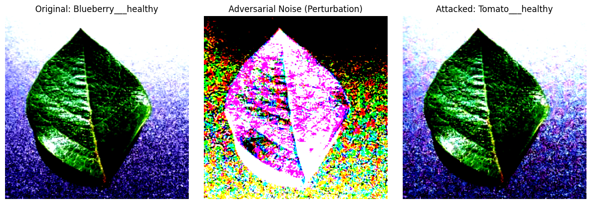
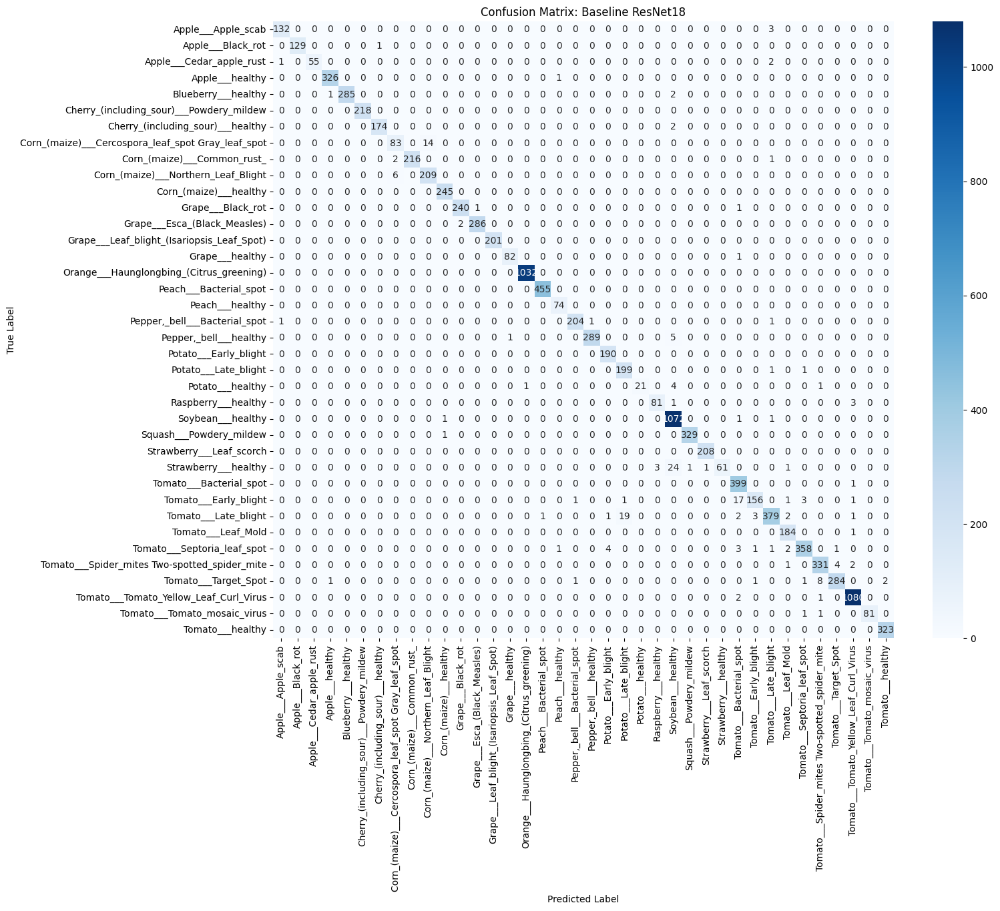

# Resilient AI for UAV-Based Crop Disease Monitoring

This repository investigates the vulnerability of deep learning architectures to adversarial attacks in agricultural settings and proposes a "Mixed Adversarial Hardening" strategy to ensure the reliability of autonomous unmanned aerial vehicles (UAVs).

## Abstract
As autonomous unmanned aerial vehicles (UAVs) become integral to global food security through real-time crop disease monitoring, the vulnerability of their underlying deep learning architectures to adversarial manipulation poses a significant systemic risk. This study investigates the susceptibility of a ResNet-18 architecture trained on the PlantVillage dataset to digital sabotage via the Fast Gradient Sign Method (FGSM). 

While our baseline model achieved a state-of-the-art clean accuracy of **98.25%**, it demonstrated a catastrophic performance degradation to **30.47%** under adversarial perturbation. Our proposed hardening approach successfully achieved an adversarial robustness of **78.71%** while simultaneously improving clean accuracy to **99.80%**.

## Key Performance Metrics

| Model State | Clean Accuracy | Adversarial Robustness (FGSM) |
| :--- | :---: | :---: |
| **Baseline ResNet-18** | 98.25% | 30.47% |
| **With Median Filtering** | - | 39.58% |
| **Hardened ResNet-18 (Ours)** | **99.80%** | **78.71%** |

---

## Adversarial Attacks in Agriculture

Digital sabotage using the **Fast Gradient Sign Method (FGSM)** introduces subtle perturbations to leaf images. To the human eye, the change is nearly invisible, but to the neural network, it shifts the classification entirely, potentially leading to incorrect crop management decisions.

*Figure 1: Original healthy Blueberry leaf vs. Adversarial Noise vs. Attacked image misclassified as Tomato healthy.*

---

## Baseline Model Evaluation

The following confusion matrix illustrates the performance of the Baseline ResNet-18 model across the 38 distinct plant-leaf disease classes within the PlantVillage dataset prior to adversarial attack.

*Figure 2: Confusion Matrix: Baseline ResNet18*

---

## Methodology

### 1. Vulnerability Assessment
We evaluated the ResNet-18 architecture against digital sabotage. The catastrophic drop in accuracy (30.47%) highlighted that high clean accuracy does not equate to security in the field.

### 2. Defense Mechanisms
* **Passive Defense (Median Filtering):** We tested spatial filtering to sanitize inputs. This provided only marginal recovery and failed to preserve critical botanical features.
* **Mixed Adversarial Hardening:** We implemented a hybrid training regime integrating both clean and adversarially-perturbed samples. This intrinsic hardening method proved essential for creating a resilient AI system.

## Dataset
The model was trained and tested on the **PlantVillage Dataset**, a comprehensive collection of 38 plant-leaf disease classes.
* **Database Link:** [PlantVillage Dataset on Kaggle](https://www.kaggle.com/datasets/abdallahalidev/plantvillage-dataset)

## Conclusion
This research demonstrates that intrinsic model hardening, rather than external preprocessing, is essential for deploying reliable, secure, and resilient AI systems in mission-critical agricultural environments.
